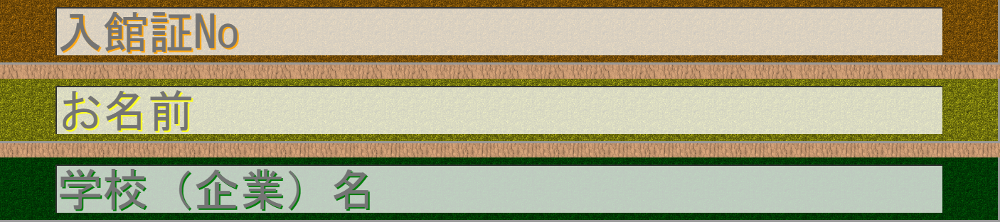
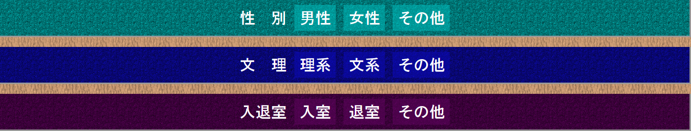

#JS
##jquery-3.2.1.min.js
おなじみのjQuery。イベントドリブンなプログラミングを行うために使用。  

##Main.js
変数・プログラム本体について記述。  
jQueryからのイベントを受信すると、命令をCONTROLLER.jsに送信する。  
また、*#wrapper_Number*以外の全ての入力欄が埋められているときに、  
*footer*要素をクリックすると、ajaxを使用してサーバーと通信する。  

##CONTROLLER.js
Main.jsからの命令を解釈して、MODEL.jsの関数を呼び出す。  
一つの命令は二文字で構成されている。  

##命令表
| １文字目 | ２文字目 | 関数 | 意味 |
|:-----:|:-----:|:-----:|
| C | 1 | MODEL_CheckInputexist_Textbox  | 入力欄が入力されているか確認する(Textbox用)  |
| C | 2 | MODEL_checkInputexist_Radiobox | 入力欄が入力されているか確認する(Radiobox用) |
| F | 1 | MODEL_FlagChenge               | フラグを更新する   |
| O | 1 | MODEL_OpenLock_Textbox         | 入力欄ロック'disabled'を解除する(Textbox用)  |
| O | 2 | MODEL_OpenLock_Radiobox        | 入力欄ロック'disabled'を解除する(Radiobox用) |
| P | 1 | MODEL_PostAjax                 | サーバーに送信する |
| S | 1 | MODEL_ShowDescription_In       | フッターの文章を更新する(Textbox用)  |
| S | 2 | MODEL_ShowDescription_Out      | フッターの文章を更新する(Radiobox用) |
| U | 1 | MODEL_UpdateColor_In           | 入力欄の'background-color'を変更する(.focusin)      |
| U | 1 | MODEL_UpdateColor_Out          | 入力欄の'background-color'を変更する(.focusout)     |
| U | 2 | MODEL_UpdateColor_First        | 入力欄の'background-color'を変更する(入館証NO入力時) |

##MODEL.js
CONTROLLER.jsから呼び出される。必要となれば、VIEW.jsの関数を呼び出す。  

##VIEW.js
1. 入力欄ロック'disabled'を解除するとき  
2. フッターの文章を更新するとき    
3. 入力欄の'background-color'を変更するとき  
  
MODEL.jsから呼び出される。  

#CSS
##Main.css
body,header,footer,#contents_area要素について記述。  

##FormBox_Text.css
  
.formbox.text要素について記述。  
*border-color・border-style*にて、影・エンボス加工を再現している。  

##FormBox_Button.css
  
.formbox.button要素について記述。  
ラジオボタンを流用しているため、ラジオボタンを表示しないようにしている。

##Config.css
各要素の色指定について記述。  
背景(#wrapper_X)には、background-blend-modeを使用している。  
本来ならば、色の種類を増やすごとに画像ファイルが一個必要だったが、  
色の種類を増やしても画像ファイルが一個で済み、読み込み時間の短縮に繋がる。  
  

#PHP
##run.php
サーバー側の処理について記述。  
*Raspberry Pi 3* + *XAMPP*でも動作するように、  
SQLでデータベースに登録だけの、シンプルな構成となっている。
